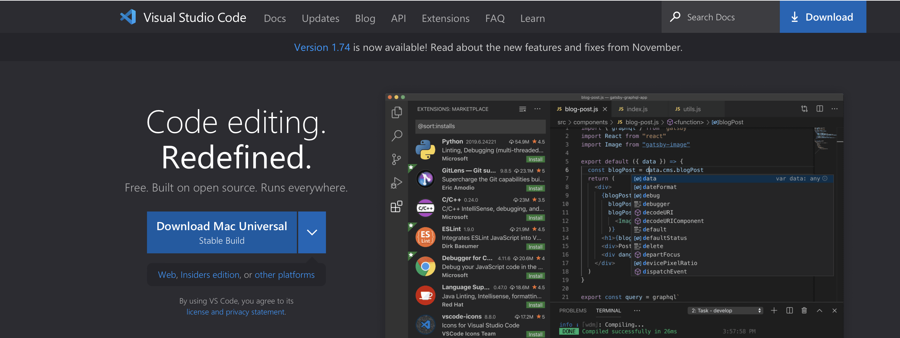
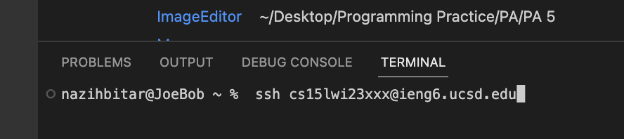
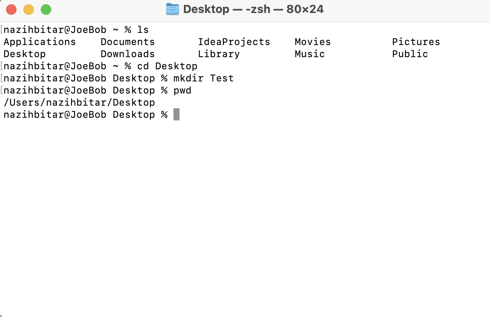

Welcome to your first 15L lab. This lab is going to be of great fun.

# There are three main sections:
- Installing Visual Studio Code
- SSH
- Trying some Fun Commands

# Part one: Installing Visual Studio Code
 1) Open your prefered browser and head to https://code.visualstudio.com
 2) Hit the download Button for your specified version.
 
 4) Once completed it should like this:
 

# Part Two: SSH
This is where it gets fun. SSH is the equivalent to using a Remote Desktop, but there is no GUI. Just a command line interface.

1) Find your username and password. First of all login to this page: https://sdacs.ucsd.edu/~icc/index.php

2) From here you will be able to find the three letters that will be used in your login.

3) Then you will need to reset your password: https://docs.google.com/document/d/1hs7CyQeh-MdUfM9uv99i8tqfneos6Y8bDU0uhn1wqho/edit

4) You now will open you visual studio terminal and run this command:


5) Now use your own password. Keep in mind you will NOT be able to see what you are typing.

6) Once you see this, you are done:
```
Hello cs15lwi23ajy, you are currently logged into ieng6-201.ucsd.edu

You are using 0% CPU on this system

Cluster Status 
Hostname     Time    #Users  Load  Averages  
ieng6-201   11:35:01   15  0.08,  0.15,  0.14
ieng6-202   11:35:01   12  0.04,  0.13,  0.12
```

# Part Three: 
Now you get to type in some commands into the termial window!
Here are some commands for you to try out:
* `ls` This lists out all the items in your current directory.
* `cd <item>` This lets you enter different files that you see from ls.
* `mkdir <directory name>` This lets you create a new file/ directory.
* `pwd` This shows you what directory you are in.
*  `clear` This clears your terminal window.

Here are examples of the usage of these commands:

