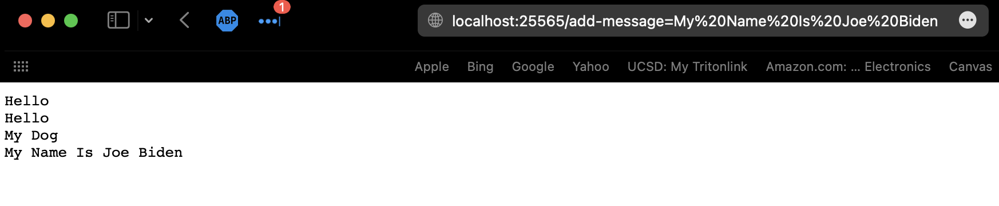
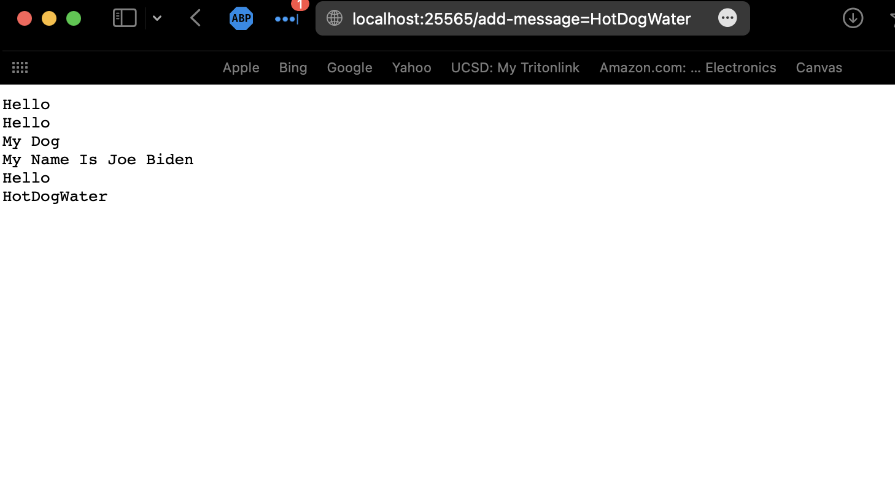
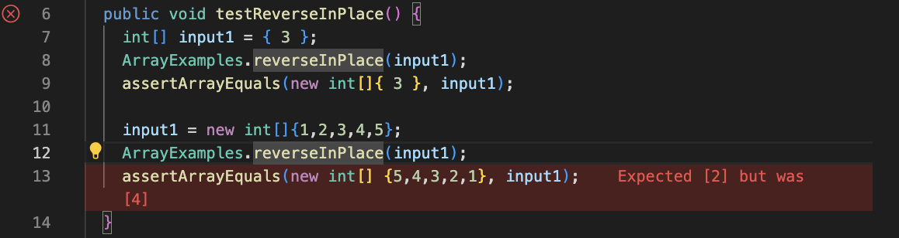

# Ned Bitar's Lab Report 2.
##### This lab report will be broken down into three sections:

##### - Part 1: Web Server

##### - Part 2: Debugging

##### - Part 3: Things learned from week 2 or 3.
<br>

## Part 1: WebServer
This is a piece of software written by me, that simply<br>
takes input from the URL bar and then displays it for the user.<br>
My implementation specifically keeps track of the input, and displays <br>
it at once.
<br><br>
Here is the code for this:
<br>
```java
 String[] parameters = null;
    String history = "";

    private static String cannedURL = "add-message";

    public String handleRequest(URI url) {
        if (url.getQuery().contains(cannedURL)) {
            parameters = url.getQuery();
            this.history = this.history + parameters[1] + "\n";
            return history;
        }
        return "not it chief";
    }

    class NumberServer {
        public static void main(String[] args) throws IOException {
            if(args.length != 0) {
                System.out.println("Missing port number! Try any number between 1024 to 49151");
                return;
            }
            int port = 25565;//Integer.parseInt(args[0]);
            Server.start(port, new Handler());
        }
    }
```
### Screenshot showing StringServer Usage:
#### Screenshot: 1

<br><br>

The getQuery() method is used to extract the query component of a URL. The query component of a URL is the part of the URL that follows the ? character and contains additional information to be passed to the server.

In your code, the handleRequest method takes a URI object as an input, and it checks if the query component of the URL contains the cannedURL string. If it does, it extracts the part of the query that comes after the "=" sign. This extracted part represents the information that needs to be added to the history string. The updated history string is then returned to the user.

By using the getQuery() method, you are able to access the query component of the URL and extract the required information without the need to use the .split() method. This makes the code more efficient and easier to understand, as it follows the ethos of simplicity.
<br><br> 
#### Screenshot: 2

<br><br>

The code consists of two classes, Handler and NumberServer. The Handler class implements the handleRequest method, which is called when the URL path is changed. The method checks if the URL path contains the string stored in the cannedURL variable, which is "add-message". If the URL path does contain the string, the method splits the path using "=" as a separator, and appends the resulting value to the history string. The updated history string is then returned to the user.

The NumberServer class sets up a server with a specified port number. If no port number is provided in the command line arguments, it defaults to 25565. The start method of the Server class is called with the specified port number and an instance of the Handler class, allowing the handleRequest method to handle incoming requests.
## Part 2: Debugging
In this assignment, we were tasked with fixing a pre-written buggy code. We utilized debugging techniques to identify and resolve the issues in the code. To validate our changes, we utilized JUnit tests, a popular testing framework for Java code, to ensure the code was functioning as expected. Through this process, we gained practical experience in debugging and testing Java code, improving our overall coding skills

#### Failue Inducing Input: ArrayTests
We have a method that is suppose to reverse in place. If you give this program an array of integers: `[1, 2, 3, 4, 5]`, and it should output 
`[5, 4, 3, 2, 1]`. We can write a simple test like this: <br>
```java
public void testReverseInPlace() {
    int[] input1 = { 3 };
    ArrayExamples.reverseInPlace(input1);
    assertArrayEquals(new int[]{ 3 }, input1);

    input1 = new int[]{1,2,3,4,5};
    ArrayExamples.reverseInPlace(input1);
    assertArrayEquals(new int[] {5,4,3,2,1}, input1);
  }
  ```
This test will tell us if our code is running correctly.
#### Screenshot: Shows what an Error in J-Unit Looks like

The way J-unit works is that it runs from top to bottom. It will highlight the test that fails in red. All the tests before the highlighted have passed.
<br><br>
#### Code for the test that passed:
  ```java
  int[] input1 = { 3 };
    ArrayExamples.reverseInPlace(input1);
    assertArrayEquals(new int[]{ 3 }, input1);
 ```
#### Code For the test that failed:
```java
input1 = new int[]{1,2,3,4,5};
    ArrayExamples.reverseInPlace(input1);
    assertArrayEquals(new int[] {5,4,3,2,1}, input1);
```
#### Here is the code with bug:
```java
static void reverseInPlace(int[] arr) {
  for(int i = 0; i < arr.length; i += 1) {
    arr[i] = arr[arr.length - i - 1];
  }
}
```
The original code didn't work because it swapped each element with itself, causing no change to the array. To reverse an array in place, swap the first element with the last element, the second with the second to last, and so on, until the middle of the array is reached.

#### Here is how I fixed it:
```java
static void reverseInPlace(int[] arr) {
	for (int i = 0; i < arr.length / 2; i += 1) {
		int temp = arr[i];
		arr[i] = arr[arr.length - i - 1];
		arr[arr.length - i - 1] = temp;
	}
}
```
This solves the issue of the element swapping with itself. We also change the actual array so we do not have to worry about refrences being incorrect.

## Part 3: Things I learned from the last two weeks:
The past week has been a valuable learning experience for me. I had the opportunity to work with JUnit, which greatly assisted me in completing the programming assignment due that week. In particular, I struggled with understanding the proper usage of the assertEquals() method, but through the experience gained with the labs, I was able to clarify my understanding. Additionally, I was introduced to web programming using Java and am eager to explore its potential by incorporating CSS to create visually appealing websites and potentially even games. The subject of server technology was particularly intriguing to me as I have prior experience creating Minecraft servers, which are based on Java. Gaining a deeper understanding of server technology has been a fun and enriching experience.
