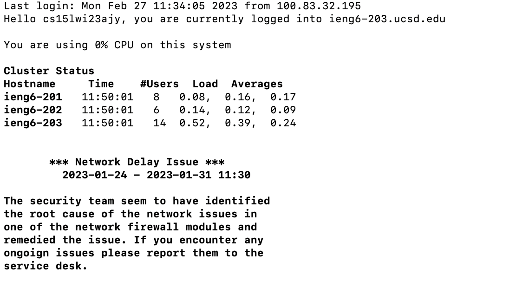
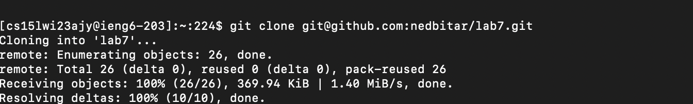
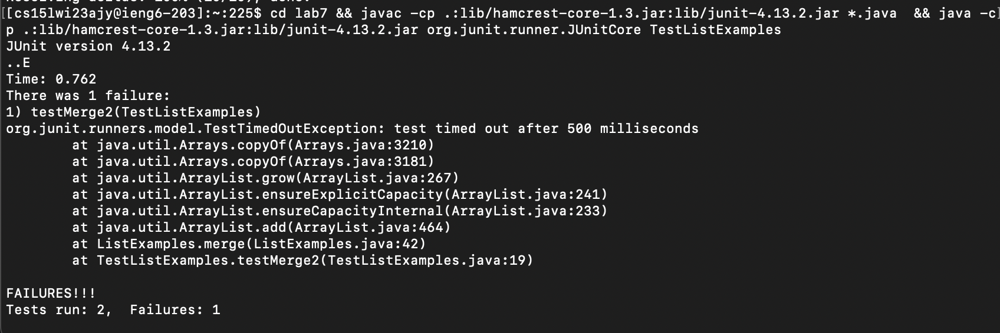
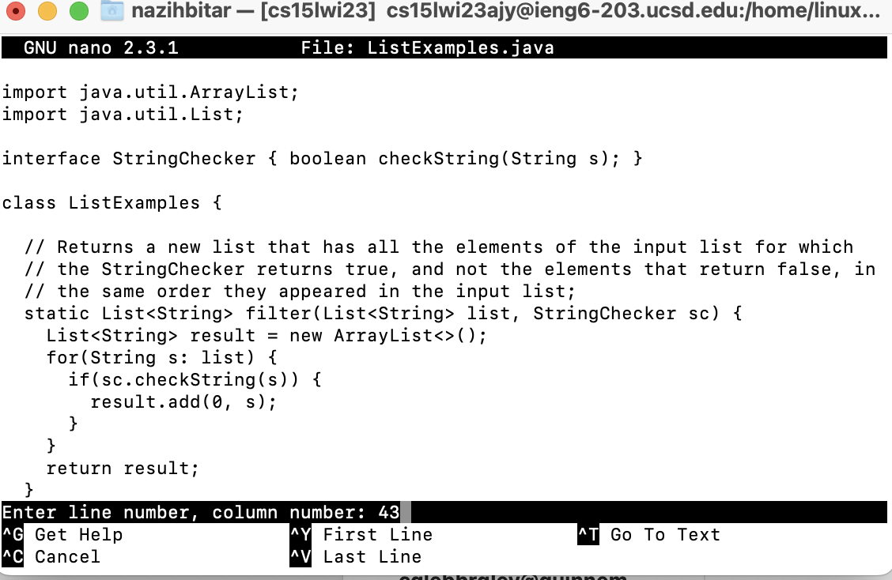
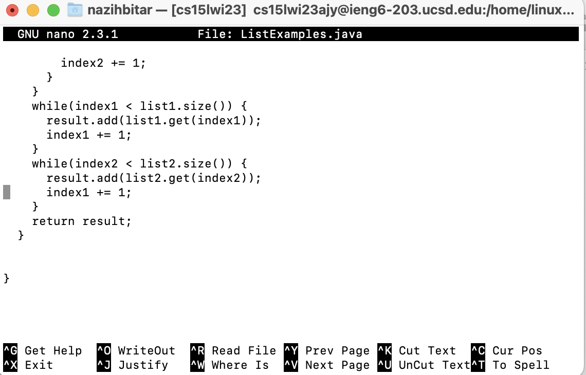
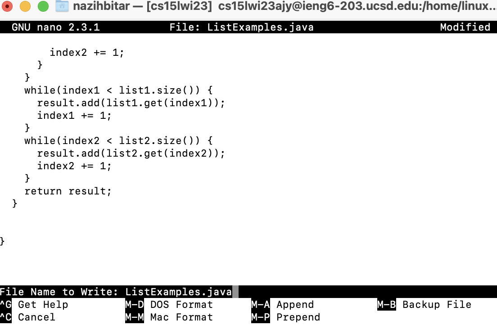
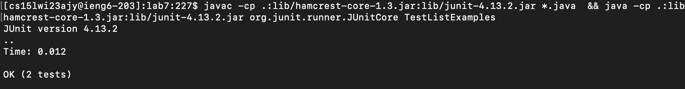
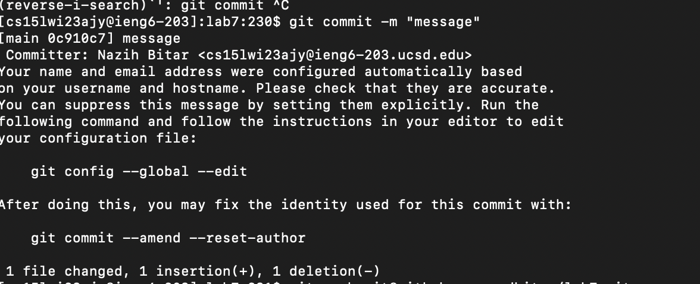

<h2>Step 1: Login to ieng6</h2>

```
ssh cs15lwi23ajy@ieng6.ucsd.edu
```


I pressed the the up arrow <`up`> 
<h2>Step 2: Cloning the Repo</h2>

```
git clone git@github.com:nedbitar/lab7.git
```

I pressed the up Arrow Twice <`up`><`up`>  
<h2>Step 3: Change Directory + Compile Tests + Running the Tests</h2>

```
cd lab7 &&
javac -cp .:lib/hamcrest-core-1.3.jar:lib/junit-4.13.2.jar *.java &&
java -cp .:lib/hamcrest-core-1.3.jar:lib/junit-4.13.2.jar org.junit.runner.JUnitCore TestListExamples
```


I saved this one to my clipboard <```command```><v>
<h2>Step 4: Opening the File Editor:</h2>

```
nano ListExamples.java
```

I literally just typed in.

<h2>Step 5: Editing the File:</h2>

```
<control><shift><-> 43
```
Then press the:
```<Right Arrow> (12 times) <BackSpace> <2>```
 (essentially we are changing the index1 to index2)

<h2>Step 6: Save and Exit:</h2>
  
```
<control><o><enter><control><x>
```
  
 
  
<h2>Step 7: Recompile and Run Tests:</h2>
  
```
javac -cp .:lib/hamcrest-core-1.3.jar:lib/junit-4.13.2.jar *.java &&
java -cp .:lib/hamcrest-core-1.3.jar:lib/junit-4.13.2.jar org.junit.runner.JUnitCore TestListExamples
```

<h2>Step 8: Adding the Changes:</h2>
  
```
git add ListExamples.png
```
  

  

  
```
<control><r> add <enter>
```
<h2>Step 9: Commiting the Changes:</h2>
  
```
git commit -m "message" 
```
  

 
```
<control><r> c <enter>
```

<h2>Step 10: Pushing the Changes:</h2>
  
```
git push git@github.com:nedbitar/lab7.git
```
  

  
```
<control><r> p <enter>
```
