<h1> Revisiting Lab Report 3 </h1>
                                 

Lab report 3 was fascinating to me because it gave me better insight into the way the grep command
worked. It is arguably one that I have used time-and-time again during this course. For this lab report,
I want to explore four different command line options for the <code>less</code> command.

<h2><code>-N</code> Displays number on each line of the output.</h2>

Here is the syntax for the command:
  <code>less -N [filename] </code>
    Filename is the name of the file we want to view, and less will display what is inside, with the 
    line numbers on the left side.  
  <b> *** WARNING: "-N" needs to be captialized! ***</b>
    

<h3>Example 1:</h3>
Command run:
<code>less -N ch1.txt</code>
  
      
<h4>Output:</h4>
      
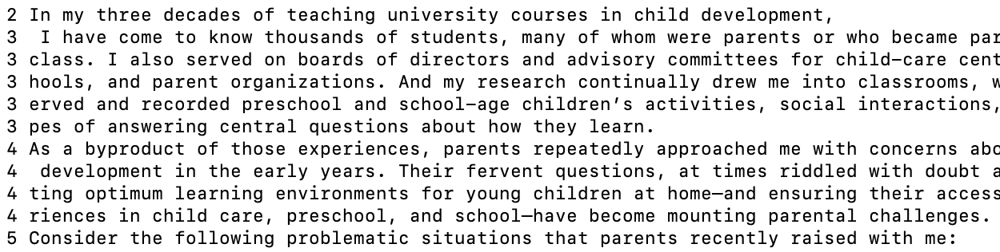
      

This opens the ch1.txt file and shows the line number on the left of the screen.

<h3>Example 2:</h3>
Command run:
      
<code> less -N ch4.txt </code>
      
<h4>Output:</h4>
      
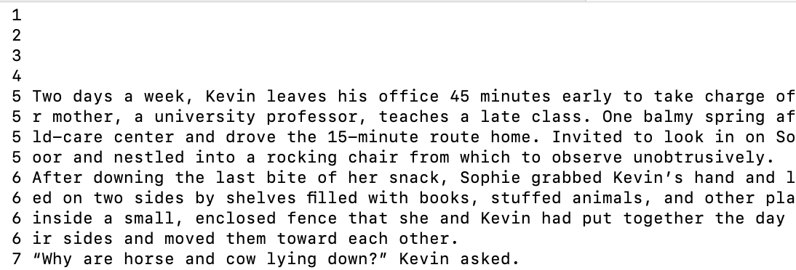
      

 This is a good example of what it looks life if the line is exmpty. It still counts it as a space.
How cool!

  
<h2><code>-i</code>Allows for case-insensitive search within a tex file</h2>

Here is the syntax for the command:
  <code>less -i [filename] </code>
    Filename is the name of the file we want to view, and less will display what is inside, with the 
    option to search. Once less is open you type: 
<code>-i</code>

This enables ignore case in search. Here is the syntax for search:

<code>/< phrase ></code>

  
  <b> *** WARNING: "-i" needs to be lowercase! ***</b>
    

less will tell you if you enabled it correctly.

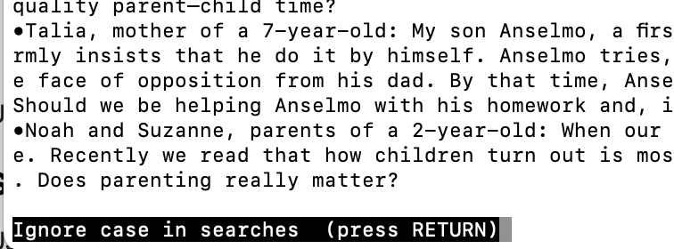

<h3>Example 1:</h3>
Commands run:
<code>less -i ch1.txt</code> 
<code>/changes</code>

      
<h4>Output:</h4>
      
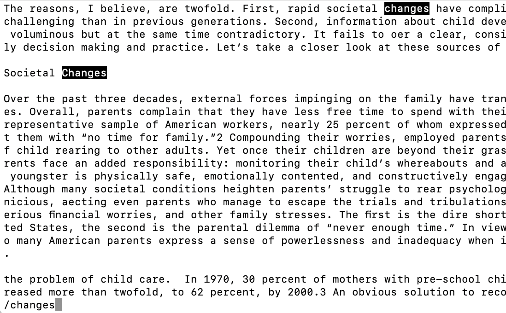
      

This opens the ch1.txt file and shows the text file with a second command line under.
This is where you type what you are looking for, and in this case I typed changes.

<h3>Example 2:</h3>
Commands run:
<code>less -i ch1.txt</code>    
<code>/joeBiden </code>
      
<h4>Output:</h4>
      
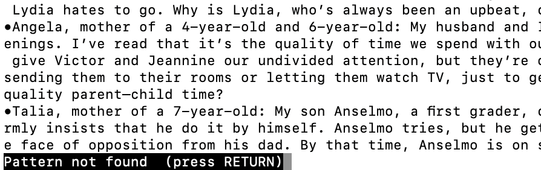
      

This is a great example of what the less command returns when it cannot find something

<h2><code>?</code>Allows you to search a file backwards</h2>

Here is the syntax for the command:
  <code>less[filename] </code>
    Filename is the name of the file we want to view, and less will display what is inside. Then it allows you
  to input search parameters. You then will do this:
  <code>?< phrase ></code> This will search for the word or phrase but, will search the file backwards.
    

<h3>Example 1:</h3>
Commands run:
<code>less ch1.txt</code>
<code>?Americans</code>
  
      
<h4>Output:</h4>
      
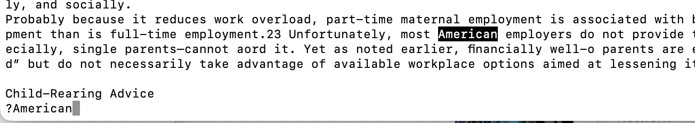
      

This allows us to search for pervious occurences of the word Americans

<h3>Example 2:</h3>
Commands run:
      
<code> less -i ch4.txt </code>
<code>?days</code>
      
<h4>Output:</h4>
      
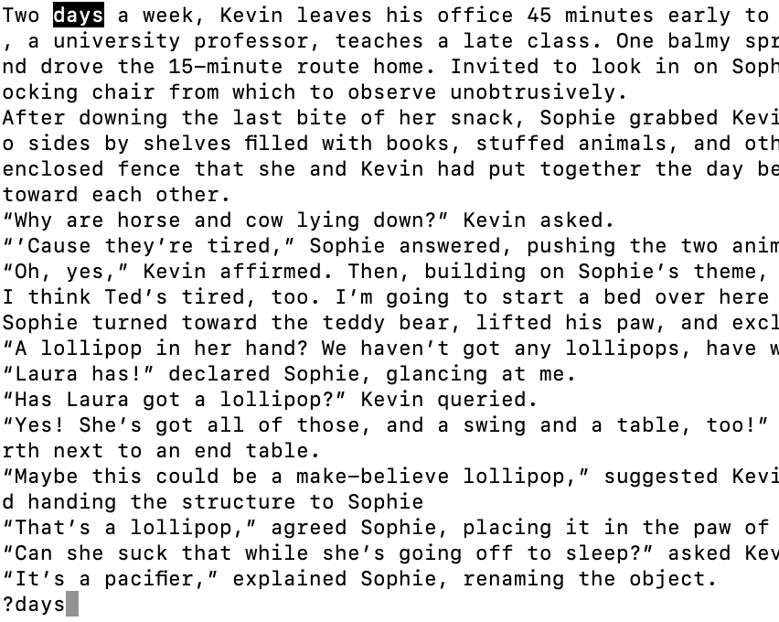
      

This essentially searches from the last displayed line, which ends in "object." in this case, to the start of the text file. Here
we found only 1 occurence of the word days

<h2> The Finale: Using multiple options in a search</h2>

The cool thing about less is it lets you enable multiple command line options at once. Once you open a file in a less, you then can
  enable all the search options you want.

  
<h3>Example 1:</h3>

 In this case we want the line numbers to display, and we to do a backwards-case-insensitive search.

First thing we do:
Here is the code I ran: <code>less -N ch1.txt</code>
here is the generalized code: <code>less -N < fileName > </code>
As explained about this shows the line numbers:
  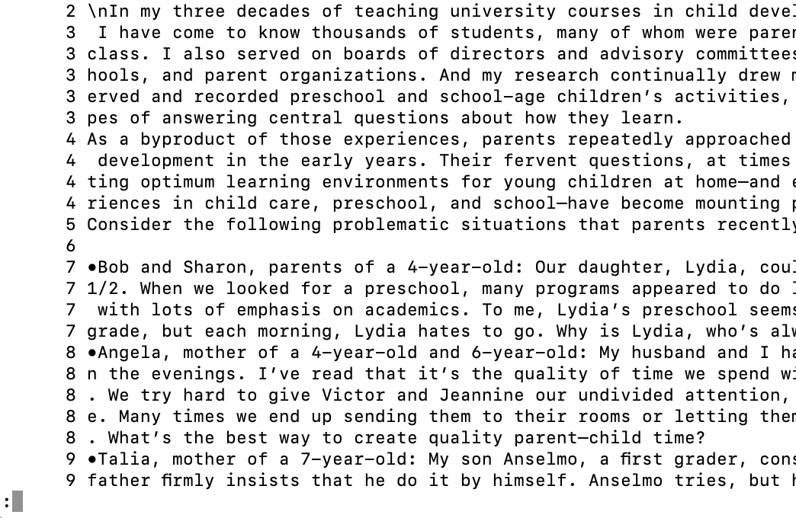
Now we can enable the search options we want:
  For the ignore case, we type in the less window <code>-i</code>
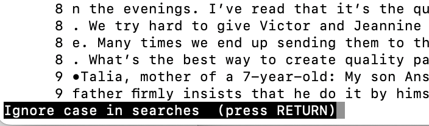 
Now lets search for something backwards:
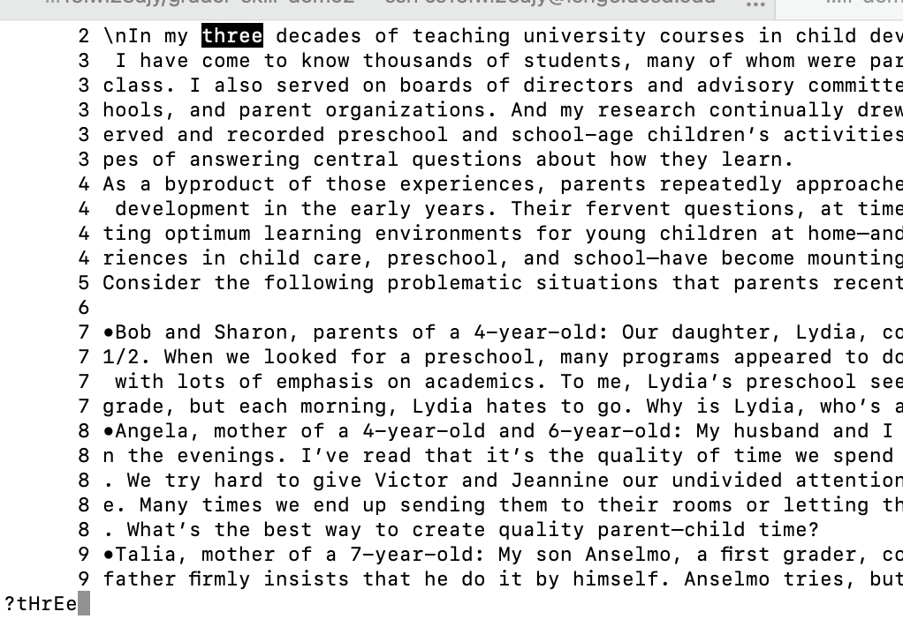
 <code>?tHrEe</code>
  
Sucess! It has found what we are looking for 

  

<h3>Example 2</h3>

Our goal is to have a case-sensitive forward search without the numbers showing on the left side.

Here is the command we run:
<code>less ch1.txt</code>
<code>-i</code>

For the keen eyed of you, you realize that -i, is used to enable case sensitive search as well. The best way to think of it is a switch. You turn the light on and off using the same switch. That is the same case as -i. It will let you know what type of search is enabled. As shown below.

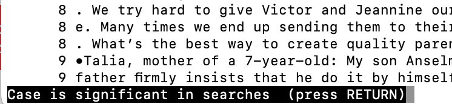
  
Now lets specifiy directionality of the search. To search forward we use <code>/(what we are looking for)</code>, and to search backwards we use<code>?(what we are looking for)</code>. Less makes it very simple to use. Here is an example of running both forward and backwards:

  <h4>For the forward search:</h4>
<code>/three</code>
  
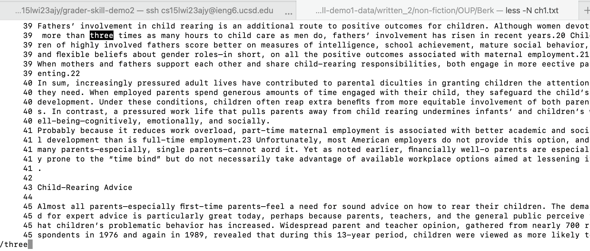
  

Keep a notice of the line it presents when we run it from the same place. This gave us line 39.

  <h4>For the backwards search:</h4>
<code>?three</h3>
  
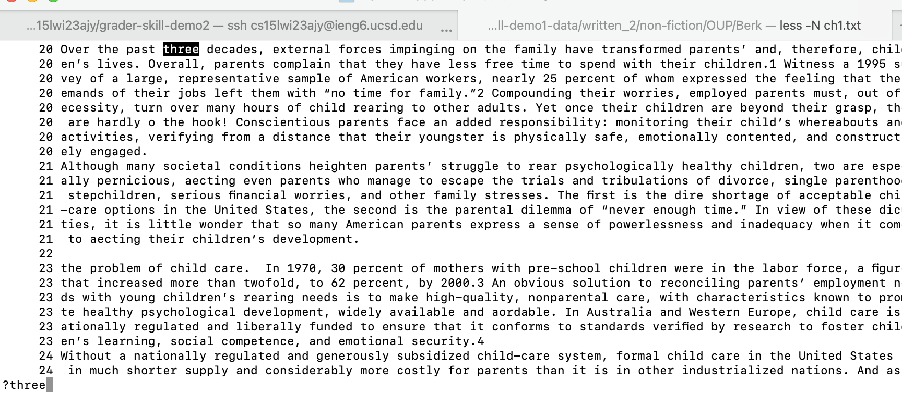
  
  
This gave us line 20 instead of 39, since it searches backwards for the closest occurence

  

  
